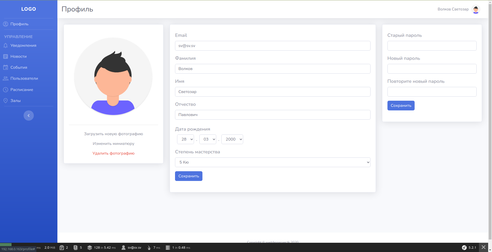

# OpenKarateServer
Серверная часть приложения для спортивного клуба

Это версия с открытым исходным кодом. Из нее убраны упоминания и символика
спортивного клуба, для которого изначально предназначался проект.

Проект состоит из двух частей:
 - Сайт (портал для администрирования приложения)
 - REST API (используется как сайтом, так и [приложением](https://github.com/Svet-00/OpenKarateApp))

Основной функционал:
 - Авторизация посредством связки логин + пароль, Cookies или JWT токена
 - Управление правами пользователей
 - Изменение данных в бд (посредством форм и таблиц)
 - Рассылка Push-Уведомлений с использованием Google Firebase Cloud Messaging

Back-end Stack:
 - Php 7.4
 - MySql
 - Symfony 5.2
 - Doctrine ORM
 - Twig template engine
 - [Google Api Client](https://github.com/googleapis/google-api-php-client)
 - [Firebase JWT](https://github.com/firebase/php-jwt)

Front-end Stack:
 - Bootstrap 4.5 (тема [SB Admin 2](https://github.com/startbootstrap/startbootstrap-sb-admin-2))
 - JS (JQuery, [DataTables](https://www.datatables.net/), [DataTable-AltEditor](https://github.com/KasperOlesen/DataTable-AltEditor) (модифицированный), [Select2](https://select2.org/))
 - SCSS
 - Gulp для сборки и минификации JS и SCSS
 
## Скриншоты

 

 

